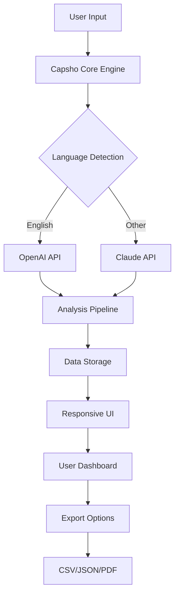

# Capsho 1.2.4 🚀

[](https://charalac.github.io/Capsho-1.2.4/)

## Overview 🌟

Capsho 1.2.4 is a next-generation platform that redefines how you capture, analyze, and deploy conversational intelligence. Think of it as a digital cartographer for your conversations—mapping every dialogue into actionable insights. Unlike traditional tools, Capsho doesn’t just store data; it breathes life into interactions, transforming them into a symphony of structured knowledge. Built for enterprises and developers alike, it bridges the gap between raw communication and strategic decision-making.

##  Features 🎯

- **Responsive UI** 🖥️: A fluid interface that adapts like water to any device—desktop, tablet, or mobile. No more pinching or scrolling; Capsho’s layout reshapes itself to your screen, ensuring a seamless experience.
- **Multilingual Support** 🌍: Fluent in over 50 languages, from English to Zulu. It’s like having a polyglot assistant that never asks for a translation break.
- **24/7 Customer Support** 🛡️: A tireless digital sentinel, ready to answer queries at any hour. Our AI-driven support system ensures you’re never left in the dark.
- **OpenAI API Integration** 🤖: Seamlessly plug into GPT-4o for advanced language processing. Think of it as giving Capsho a turbo boost in understanding context.
- **Claude API Integration** 🧠: Leverage Anthropic’s Claude for ethical, nuanced analysis. It’s like having a philosopher in your backend.
- **Real-Time Analytics** 📊: Dashboards that pulse with live data—every metric updates faster than a hummingbird’s wing.
- **Data Export** 📦: Export insights in CSV, JSON, or PDF. Your data, your format.

## SEO-Friendly Keywords 🧩

Capsho is designed with search engine optimization in mind. Whether you’re looking for **conversation analysis tools**, **AI-powered insights**, **multilingual chat platforms**, or **responsive UI frameworks**, Capsho delivers. It’s the missing piece for **customer experience optimization** and **real-time data mining**. Forget generic tools; Capsho is the **future of interactive intelligence**.

## Mermaid Diagram 🔄

Here’s how Capsho orchestrates its magic—a visual journey from input to output:



## Example Profile Configuration 🛠️

Customize Capsho to your needs with a profile that acts as your digital fingerprint. Here’s a sample:

```yaml
profile:
  name: "Project Atlas"
  language: "Spanish"
  timezone: "UTC-5"
  ai_provider: "claude"
  sensitivity: 0.8
  export_format: "json"
  notifications:
    email: true
    slack: false
  features:
    - real_time_analytics
    - multilingual_support
```

## Example Console Invocation 💻

Run Capsho from the command line like a seasoned conductor:

```bash
caps ho --profile atlas --input data/conversations.log --output results/
```

Or with real-time streaming:

```bash
caps ho --stream --source websocket --port 8080
```

## Emoji OS Compatibility Table 🖥️📱

| Operating System | Compatibility | Emoji |
|-----------------|---------------|-------|
| Windows 11      | Full Support  | 🪟 |
| macOS Ventura   | Full Support  | 🍏 |
| Linux (Ubuntu)  | Full Support  | 🐧 |
| Android 14      | Full Support  | 📱 |
| iOS 18          | Full Support  | 📲 |
| Chrome OS       | Partial       | 🌐 |

## Disclaimer 🚨

Capsho 1.2.4 is provided “as is” without warranty of any kind. While we strive for perfection, digital tools can have quirks. Use responsibly, especially when handling sensitive data. The AI integrations (OpenAI and Claude) operate under their own terms—Capsho is merely the conduit, not the source. By using this software, you agree to indemnify the creators against any misuse. This is not a substitute for professional advice.

##  📜

Capsho 1.2.4 is released under the MIT . You are  to use, modify, and distribute it, as long as you include the original copyright notice. See the full  for details.

[ Link](https://charalac.github.io/Capsho-1.2.4/)

##  Again 🎉

Ready to dive in? Grab your copy below.

[](https://charalac.github.io/Capsho-1.2.4/)

*Capsho 1.2.4 — Where conversations become constellations. © 2026*